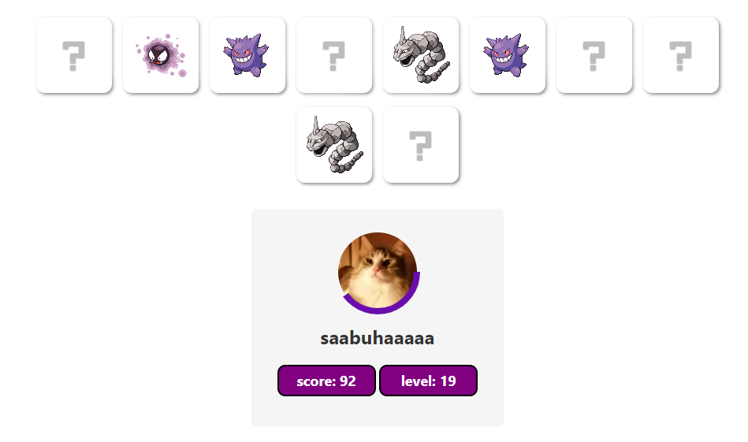
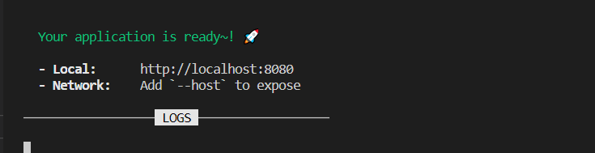
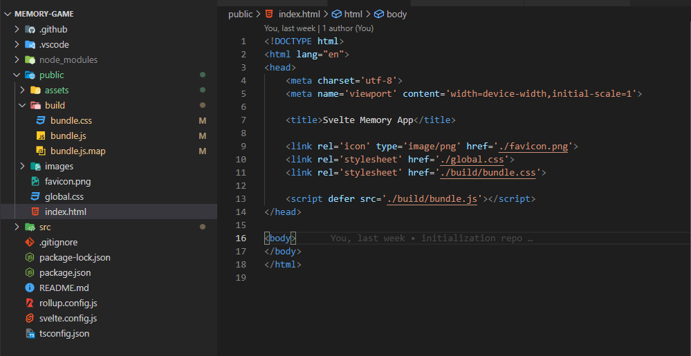
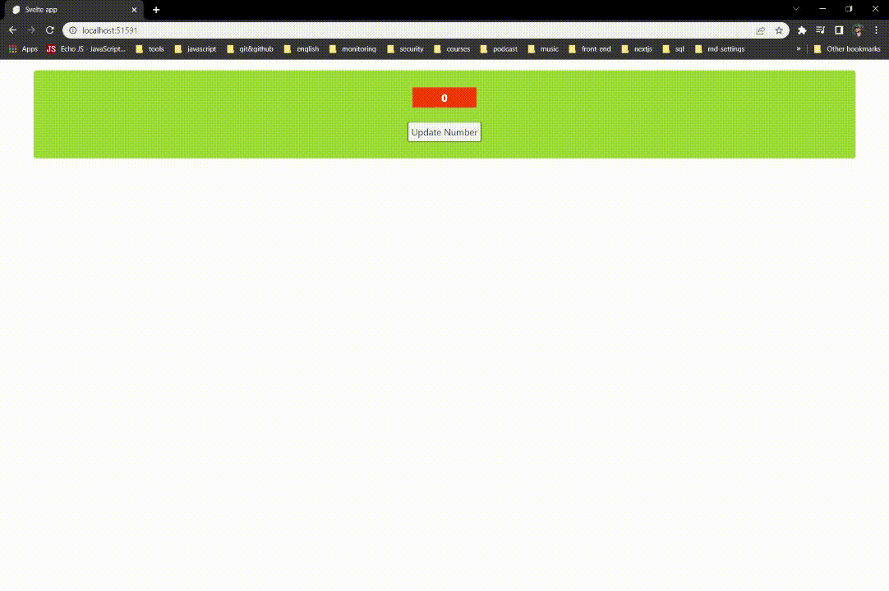
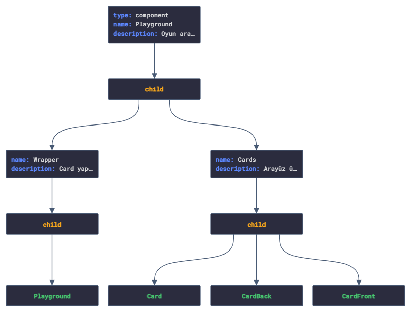
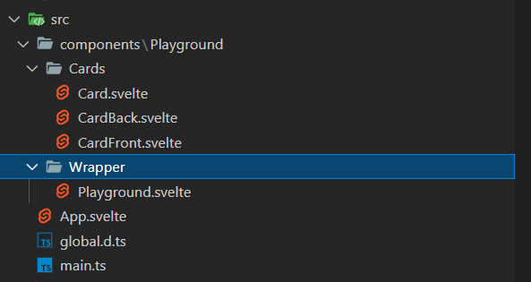
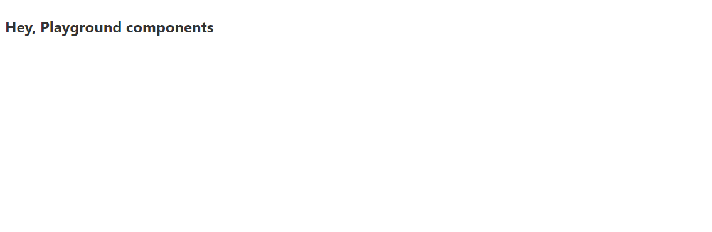

<span id="selam-sana"></span>

## Selamlaaaaar 👋

Herşeyden önce umuyorum ki bu basit döküman Svelte yolculuğunda rehber
olabilir. Son zamanlarda Svelte ile uygulama geliştirmeye başladım. Svelte'in
yapısına daha çok hakim olabilmek ve öğrendiklerimi paylaşabilmek için bu
dökümanı oluşturdum. Döküman içerisinde adım adım _Game_ bağlantısında
görebileğiniz oyunu nasıl geliştirdiğimi anlattım, ilgi duyuyorsanız aynı
adımları takip ederek benzer bir uygulama oluşturabilir, veya küçük bir kaynak
modelinde kullanabilirsiniz. Svelte içeriği iyi ayrıntılanmış dökümantasyonlara
([docs](https://svelte.dev/docs "Svelte Documentation"),
[examples](https://svelte.dev/examples/hello-world "Svelte Examples")) sahip,
dökümantasyonları inceledikten sonra uygulamayı takip etmen daha faydalı
olabilir. İçeriğin özelliklerini sol tarafta bulunan haritalandırma ile takip
edebilirsin.

<span id="proje-hakkinda"></span>

## Oyun Hakkında

Projemizde bir hafıza oyunu geliştireceğiz. Kullanıcıların seviyelerine göre
arayüz üzerinde kartlar bulunacak. Kartlara click eventi gerçekleştirildiğinde
kartlar açılacak, kullanıcılar açılan kartları eşleştirmeye çalışacaklar.
Eşleşen kartlar açık bir şekilde arayüz üzerinde dururken başarılı eşleşme
sonucunda kullanıcıya puan kazandıracak, başarısız her eşleşmede kartlar
bulundukları yerde yeniden kapatılacaklar. Bütün kartlar eşleştiklerinde, bir
sonraki seviyede yer alan kartlar arayüze kapalı olarak yeniden gelecektir.

<p align="center">
  
</p>

Oyun başlangıcında kullanıcıdan bir kullanıcı adı girmesi, avatar listesinde
yer alan görsellerden birini seçmesi beklenecektir(Avatarlar ne kadar evcil
gözükseler de, güç içlerinde gizli 🐱‍👤). Bu seçilen değerler oyunun arayüzünde
kartların yer aldığı bölümün altında _score & level_ değerleri ile
birlikte gösterilecektir. Kullanıcı adı ve seçilen avatar stabil değerler olarak
tutulurken, _score & level_ değerleri dinamik olarak kullanıcı davranışına göre
güncellenecektir.

<span id="svelte-nedir"></span>

## Svelte nedir?

Svelte günümüz modern library ve framework habitatının komplex yapılarını
azaltarak daha basit şekilde yüksek verimliliğe sahip uygulamalar
geliştirilmesini sağlamayı amaçlayan bir derleyicidir. Modern framework/library
ile birlikte geride bıraktığımız her süreçte farklı ihtiyaçlar için yeni bir
öğrenme süreci ortaya çıktı. Öğrenme döngüsünün sürekli olarak geliştiricilerin
karşısına çıkması bir süre sonrasında illallah dedirtmeye başladığı gayet
aşikar. Svelte'in alışık olduğumuz _html & css & js_ kod yapılarına benzer bir
sözdiziminin kullanılması, props ve state güncellemeleri için 40 takla
atılmasına gerek kalınmaması gibi özellikleri ile bu döngünün dışına çıkmayı
başarabilmiş.. ve umuyorum ki bu şekilde sadeliğini korumaya devam edebilir.

[Stack Overflow Developer Survey 2021](https://insights.stackoverflow.com/survey/2021#section-most-loved-dreaded-and-wanted-web-frameworks "Stack Overflow Developer Survey 2021") anketinde geliştiriciler tarafından %71.47 oranıyla en çok sevilen
web framework Svelte olarak seçildi.

<span id="svelte-projesi-olusturma"></span>

## Svelte projesi oluşturma

Npx ile yeni bir proje oluşturma:

```js
npx degit sveltejs/template remember-em-all
```

Svelte Typescript notasyonunu desteklemektedir. Typescript üzerinde
yapabileceğiniz bütün işlemleri Svelte projenizde kullanabilirsiniz.

```js
cd remember-em-all
node scripts/setupTypeScript.js
```

Gerekli olan bağımlılıkları projemize ekleyerek ayağa kaldırabiliriz.

```js
npm install
npm run dev
```

Bu komutlar sonrasında konsol üzerinde projenin hangi port üzerinde çalıştığını
kontrol edebilirsiniz. Windows işletim sistemlerinde varsayılan 8080 portu
işaretli iken, bu port üzerinde çalışan proje bulunuyorsa veya farklı işletim
sistemi kullanıyorsan port adresi değişkenlik gösterebilir.

<p align="center">
  
</p>

<span id="svelte-nasil-calisir"></span>

## Svelte nasıl çalışır?

Svelte bileşenleri _.svelte_ uzantılı dosyalar ile oluşturulur. HTML'de benzer
olarak _script, style, html_ kod yapılarını oluşturabilirdiğiniz üç farklı bölüm
bulunuyor. Uygulamanızı oluşturduğunuzda bu bileşenler derlenerek, pure
Javascript kodlarına dönüştürülür.

<p align="center">
  
</p>

Svelte derleme işlemini runtime üzerinde gerçekleştiriyor. Bu derleme işlemiyle
birlikte Virtual DOM bağımlılığını ortadan kalkıyor.

<span id="bagimliliklar"></span>

## Proje bağımlılıkları

- #### Typescript
  Typescript, Javascript kodunuzu daha verimli kılmanızı ve kod kaynaklı
  hataların önüne geçilmesini sağlayan bir Javascript uzantısıdır. Projenizde
  yer alan _.svelte_ uzantılı dosyalarda kullanabileceğiniz gibi, _.ts_
  dosyalarını da destekler.
- #### Rollup
  Svelte kurulumunuzla birlikte root folder üzerinde rollup.config.js dosyası
  oluşturulacaktır. Rollup javascript uygulamalar için kullanılan bir modül
  paketleyicidir, uygulamamızda yer alan kodları tarayıcının anlayabileceği
  şekilde ayrıştırır.

<span id="svelte-projesini-inceleme"></span>

## Svelte yapısını inceleme

Varsayılan _src/App.svelte_ dosyasını kontrol ettiğimizde daha önce
bahsettiğimiz Javascript kodları için script, html kodları için main ve
stillendirme için style tagları bulunuyor.

🎈 _script_ etiketinde lang özelliği Typescript bağımlılığını eklediğimiz
için _ts_ değerinde bulunmaktadır. Typescript kullanmak istediğiniz _.svelte_
dosyalarında lang attribute'ine ts değerini vermeniz yeterli olacaktır.

🎈 _main_ etiketinde _html_ kodlarını tanımlayabileceğin gibi, bu etiketin
dışında da dilediğin gibi html kodlarını tanımlayabilirsin. Svelte
tanımladığın kodları _html_ kodu olarak derlemesine rağmen, proje yapısının
daha okunabilir olabilmesi için kapsayıcı bir etiketin altında toplanması daha
iyi olabilir.

🎈 _style_ etiketi altında tanımladığın stil özelliklerinden, aynı dosyada
bulunan _html_ alanında seçiciler etkilenir. Global seçicileri
kullanabileceğiniz gibi, global olarak tanımlamak istediğiniz seçicileri
`public/global.css` dosyasında düzenleyebilirsin.

🎈 Proje içerisinde compile edilen bütün yapılar `/public/build/bundle.js`
dosyasında yer almaktadir. _index.html_ dosyası buradaki yapıyı referans alarak
Svelte projesini kullanıcı karşısına getirmektedir.

## Biraz pratik 🏃

Burada birkaç örnek yaparak Svelte'i anlamaya, yorumlamaya çalışalım. Kod
örnekleri oyun üzerinde sıkça kullanacağımız yapılar için bir temel oluşturacak.

App.svelte dosyasında _name_ isminde bir değişken tanımlanmış. Typescript
notasyonu baz alındığı için değer tipi olarak _string_ verilmiş. Bu notasyon ile
anlatım biraz daha uzun olabileceği için kullanmamayı tercih edicem. Github
üzerinde bulunan kodlar ile, burada birlikte oluşturacaklarımız farklılık
gösterebilir.. panik yok, Typescript'e
[hakim olabileceğine](https://youtube.com/shorts/oyIO1_8uNPc "senin kocaman kalbin <33")
eminim.

#### Variable erişimi

Script üzerinde tanımlanan değerleri html içerisinde çağırabilmek için
&lcub; &rcub; kullanılmalıdır. Bu template ile değer tipi farketmeksizin
değişkenleri çağırarak işlemler gerçekleştirilebilir.

_app.svelte_

<div class="code-wrapper" style="padding:0 10px; margin: 0 30px; border: 2px dashed #ff3e00; background: #fff;">
<pre style="border: none;" class="prettyprint lang-js">
{`\<script>
  const user = "sabuha";
</script>`}
</pre>
<pre style="border: none;" 
  class="prettyprint lang-html">{`\<span>{user} seni izliyor!</span>
`}</pre>
<pre style="border: none;" class="prettyprint lang-css">{`\<style>
  h1 {
    color: rebeccapurple;
  }
</style>`}</pre>
</div>

Bu tanımlama ile birlikte `user` değerine tanımlanan her değeri dinamik olarak
`html` içerisinde çağırabilirsin. biraz daha biraz daha karıştıralım..
_user_ değeri sabuha değerine eşit olduğu durumlarda 'seni izliyor!' yerine
'bir kedi gördüm sanki!' değerini birlikte ekrana getirelim.

_app.svelte_

<div class="code-wrapper" style="padding:0 10px; margin: 0 30px; 
  border: 2px dashed #ff3e00; background: #fff;">
<pre style="border: none;" class="prettyprint lang-js">
{`\<script>
  const user = "sabuha";
</script>`}
</pre>
<pre style="border: none;" 
  class="prettyprint lang-html">{`\<span>{user === "sabuha" ? "bir kedi gördüm sanki!" : "seni izliyor!"}</span>
`}</pre>
<pre style="border: none;" class="prettyprint lang-css">{`\<style></style>`}</pre>
</div>

_html_ içerisinde kullandığımız &lcub; &rcub; tagları arasında condition
yapıları gibi döngü, fonksiyon çağırma işlemleri gerçekleştirebilirsin.
Sırasıyla hepsini gerçekleştireceğiz.

#### Reaktif Değişkenler

Değişkenlik gösterebilecek dinamik verilerin güncellendiğinde, DOM üzerinde
yer alan referansı benzer olarak güncellenecektir.

_app.svelte_

<div class="code-wrapper" style="padding:0 10px; margin: 0 30px; 
border: 2px dashed #ff3e00; background: white;">
<pre style="border: none;" class="prettyprint lang-js">
{`\<script>
  let number = 0;
  
  const randomNumber = () => {
    number = Math.round(Math.random() \* 15);
  };
</script>`}

</pre>
<pre style="border: none;" 
  class="prettyprint lang-html">{`\
<main>
  <h3>{number}</h3>
  <button on:click={randomNumber}>Update Number</button>
</main>
`}</pre>
<pre style="border: none;" class="prettyprint lang-css">{`\<style>
  main {
    border-radius: 5px;
    background-color: yellowgreen;
    padding: 5px;
    margin: 10px 50px;
  }
  
  h3 {
    background-color: orangered;
    width: 100px;
    color: white;
  }
  
  button {
    border: 1px solid black;
    cursor: pointer;
  }
  
  h3,button {
    display: block;
    text-align: center;
    margin: 25px auto;
    padding: 5px;
  }
</style>`}</pre>
</div>

Tanımladığımız _numb_ değeri her güncellendiğinde, DOM üzerinde bu değer
yeniden ve sıkılmadan güncellenmeye devam edecektir.

<p align="center">
  
</p>

#### Component/Child Component kullanımları

<span id="component-ve-dizin-yapisi"></span>

## Arayüzü oluşturma

### Component Yapısı

<p align="center">

<label><i>[JSONVisio](https://jsonvisio.com/ "JSONVisio web link") ile JSON
verilerinizi görselleştirebilir, bu yapıdaki dosyalarınızı daha okunabilir
formata çevirebilirsiniz.</i></label>
</p>

Playground Componenti altında oyunda yer alan bütün yapıları tutacağız. Bununla
birlikte arayüz üzerinde yer alan kartları ve kullanıcının gerçekleştirmiş
olduğu eventleri burada takip edeceğiz. `src` klasörünün altında Playground için
tanımlayacağımız dizin yapısını aşağıdaki görseldeki gibi oluşturalım.

<p align="center">

</p>

#### Playground Componenti

Playground componentinde bazı güncellemeler gerçekleştirerek, app.svelte
dosyamızda import edelim. Import edilen componentler html içerisinde atanan
isimle birlikte taglar içerisinde tanımlanabilir.

`Playground.svelte`

<pre>
  <code class="language-js">
{`
some code
`}
  </code>
</pre>

`App.svelte`

<pre>
  <code class="language-js">
{`
some code
`}
  </code>
</pre>

<p align="center">

</p>

Playground componentimizde kartları oluşturabiliriz. Card.svelte componentinde
kart yapısına uygun tanımlamaları gerçekleştiriyoruz. App.svelte dosyasında
yaptığımız gibi, Card.svelte componentini Playground componentinde tanımlayalım.

<span id="github-page-ile-deploy"></span>

## GitHub Pages ile Deploy

## Kaynak

- Svelte nedir?

- https://svelte.dev/blog/svelte-3-rethinking-reactivity

- Svelte Documentation:

- https://svelte.dev/examples/hello-world
- https://svelte.dev/tutorial/basics
- https://svelte.dev/docs
- https://svelte.dev/blog
- https://svelte.dev/blog/svelte-3-rethinking-reactivity

* Svelte Projesi Oluşturma

- https://developer.mozilla.org/en-US/docs/Learn/Tools_and_testing/Client-side_JavaScript_frameworks/Svelte_TypeScript

- Bağımlılıklar
- https://typeofnan.dev/how-to-set-up-a-svelte-app-with-rollup/

* Deploy:

- https://developer.mozilla.org/en-US/docs/Learn/Tools_and_testing/Client-side_JavaScript_frameworks/Svelte_deployment_next

* md files importing

- https://stackoverflow.com/questions/56678488/how-to-import-a-markdown-file-in-a-typescript-react-native-project

```

```

:check en file:
