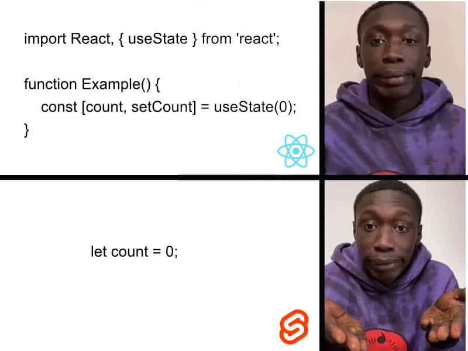

<span id="selam-sana"></span>

## Selam :wave:

Son zamanlarda Svelte ile uygulama geliştirmeye başladım. Svelte'in
yapısına daha çok hakim olabilmek ve öğrendiklerimi paylaşabilmek için bu
dökümanı oluşturdum. Döküman içerisinde adım adım 'Game' bağlantısında
görebileğiniz oyunu nasıl geliştirdiğimi anlattım, ilgi duyuyorsanız aynı
adımları takip ederek benzer veya farklı bir uygulama oluşturabilirsiniz.
Svelte içeriği iyi ayrıntılanmış dökümantasyonlara
([docs](https://svelte.dev/docs "Svelte Documentation"),
[examples](https://svelte.dev/examples/hello-world "Svelte Examples")) sahip,
dökümantasyonları inceledikten sonra uygulamayı takip etmeniz daha faydalı
olabilir. İçeriğin özelliklerini sol tarafta bulunan haritalandırma ile takip
edebilirsiniz.

<span id="proje-hakkinda"></span>

## Oyun Hakkında

Projemizde bir hafıza oyunu geliştireceğiz. Kullanıcıların seviyelerine göre
arayüz üzerinde kartlar bulunacak. Kartların üzerlerine click eventi
gerçekleştirildiğinde kartlar açılacak, kullanıcılar açılan kartları
eşleştirmeye çalışacaklar. Eşleşen kartlar açık bir şekilde arayüz üzerinde
dururken başarılı eşleşme sonucunda kullanıcıya puan kazandıracak, başarısız her
eşleşmede kartlar bulundukları yerde yeniden kapatılacaklar. Bütün kartlar
eşleştiklerinde, bir sonraki seviyede yer alan kartar arayüze kapalı olarak
yeniden gelecektir.

<p align="center">
  
</p>

Oyun başlangıcında kullanıcıdan bir kullanıcı adı girmesi, avatar listesinde
yer alan görsellerden birini seçmesi beklenecektir. Bu seçilen değerler oyunun
arayüzünde kartların yer aldığı bölümün altında score & level değerleri ile
birlikte gösterilecektir. Kullanıcı adı ve seçilen avatar stabil değerler olarak
kalacaktır, score & level değerleri dinamik olarak kullanıcı davranışına göre
güncellenecektir.

<span id="svelte-nedir"></span>

## Svelte nedir?

Svelte günümüz modern library ve framework habitatının komplex yapılarını
azaltarak daha basit şekilde yüksek verimliliğe sahip uygulamalar
geliştirilmesini sağlamayı amaçlayan bir derleyicidir. Modern framework/library
ile birlikte geride bıraktığımız her süreçte farklı ihtiyaçlar için yeni bir öğrenme
süreci ortaya çıktı.

<p align="center">
  
</p>

Öğrenme döngüsünün sürekli olarak geliştiricilerin
karşısına çıkması bir süre sonrasında illallah dedirtmeye başladılar.
Svelte'in alışık olduğumuz html & css & js kod yapılarına benzer bir
sözdiziminin kullanılması, props ve state güncellemeleri için 40 takla
atılmasına gerek kalınmaması gibi özellikleri ile bu döngünün dışına çıkmayı
amaçlamaktadır.

[Stack Overflow Developer Survey 2021](https://insights.stackoverflow.com/survey/2021#section-most-loved-dreaded-and-wanted-web-frameworks "Stack Overflow Developer Survey 2021") anketinde geliştiriciler tarafından %71.47 oranıyla en çok sevilen web
framework Svelte olarak seçildi.

<span id="svelte-projesi-olusturma"></span>

## Svelte projesi oluşturma

Npx ile yeni bir proje oluşturma:

```js
npx degit sveltejs/template remember-em-all
```

Svelte Typescript notasyonunu desteklemektedir. Typescript üzerinde
yapabileceğiniz bütün işlemleri Svelte projenizde kullanabilirsiniz.

```js
cd remember-em-all
node scripts/setupTypeScript.js
```

Gerekli olan bağımlılıkları projemize ekleyerek ayağa kaldırabiliriz.

```js
npm install
npm run dev
```

Bu komutlar sonrasında konsol üzerinde projenin hangi port üzerinde çalıştığını
kontrol edebilirsiniz. Windows işletim sistemlerinde genelde 8080 portu işaret
edilirken, bu port üzerinde çalışan proje varsa veya farklı işletim
sistemlerinde port adresi değişebilir.

<p align="center">
  
</p>

<span id="svelte-nasil-calisir"></span>

## Svelte nasıl çalışır?

Svelte bileşenleri `.svelte` uzantılı dosyalar ile oluşturulur. HTML'de benzer
olarak `script, style, html` kod yapılarını oluşturabilirdiğiniz üç farklı bölüm
bulunuyor. Uygulamanızı oluşturduğunuzda bu bileşenler derlenerek, pure
Javascript kodlarına dönüştürülür.

<p align="center">
  
</p>

Svelte'in derleme işlemini runtime üzerinde gerçekleştiriyor. Bu derleme
işlemiyle birlikte Virtual DOM bağımlılığı ortadan kalkıyor.

<span id="bagimliliklar"></span>

## Proje bağımlılıkları

- #### Typescript
  Typescript, Javascript kodunuzu daha verimli kılmanızı ve kod kaynaklı
  hataların önüne geçilmesini sağlayan bir Javascript uzantısıdır. Svelte
  `.svelte` uzantılı dosyaların yanısıra `.ts` dosyaları da destekler.
- #### Rollup
  Svelte kurulumunuzla birlikte root folder üzerinde rollup.config.js dosyası
  oluşturulacaktır. Rollup javascript uygulamalar için kullanılan bir modül
  paketleyicidir. Rollup uygulamamızda yer alan kodları tarayıcının
  anlayabileceği şekilde ayrıştırır.

<span id="svelte-projesini-inceleme"></span>

## Svelte projesini inceleme

Varsayılan src/App.svelte dosyasını kontrol ettiğimizde daha önce bahsettiğimiz
Javascript kodları için script, html kodları için main ve stillendirme için
style tagları bulunuyor.

`script` etiketinde lang attribute'i Typescript bağımlılığını eklediğimiz için
"ts" değerinde bulunmaktadır. Typescript kullanmak istediğiniz .svelte
dosyalarında lang attribute'ine ts değerini vermeniz yeterli olacaktır.

`main` etiketinde html kodlarını tanımlayabileceğiniz gibi, bu tag'ın dışında da
istediğiniz gibi html kodlarını tanımlayabilirsiniz. Svelte tanımladığınız
kodları html kodu olarak derlemesine rağmen, proje yapısının daha okunabilir
olabilmesi bir etiketin altında toplanması daha iyi olabilir.

`style` etiketi altında tanımladığınız stillendirmeler, html alanında bulunan
seçiciler etkilenir. Global seçicileri kullanabileceğiniz gibi, global olarak
tanımlamak istediğiniz seçicileri `public>global.css` dosyasında
düzenleyebilirsiniz.

Proje içerisinde compile edilen bütün yapılar `/public/build/bundle.js`
dosyasında yer almaktadir. index.html dosyası buradaki yapıyı referans alarak
svelte projesini kullanıcı karşısına getirmektedir.

Burada birkaç örnek yaparak Svelte'i anlamaya, yorumlayamaya çalışalım.

App.svelte dosyasında name isminde bir değişken tanımlanmış. Typescript
notasyonu baz alındığı için değer tipi olarak `string` verilmiş. Bu notasyon ile
anlatım biraz daha uzun olabileceği için kullanmayı tercih etmicem.

#### Variable erişimi

Script üzerinde tanımlanan değerleri html içerisinde çağırabilmek için
&lcub; &rcub; kullanılmalıdır. Bu template ile değer tipi farketmeksizin
değişkenleri çağırarak işlemler gerçekleştirilebilir.

<div class="custom-code-block">
<pre style="background: #ff3e00; color: white; font-weight: bold; padding: 
  10px 15px 0 15px; margin: 15px; border-left: 5px solid black;">
  // app.svelte
  <code class="language-svelte">
{`
\<script>
  const user = "sabuha";
</script>

\<span>{ user } seni izliyor!</span>

\<style>
h1 {
color: rebeccapurple;
}
</style>
`}
</code>

</pre>
</div>

Bu tanımlama ile birlikte `user` değerine tanımalanan her değer dinamik olarak
özellik kazanacaktır. biraz biraz karıştıralım.. `user` değeri sabuha'ya eşit
olduğu durumlarda 'seni izliyor!' yerine 'bir kedi gördüm sanki!' değeri ekrana
yazılsın.

<div class="custom-code-block">
<pre style="background: #ff3e00; color: white; font-weight: bold; padding: 
  10px 15px 0 15px; margin: 15px; border-left: 5px solid black;">
  // app.svelte
  <code class="language-svelte">
{`
\<script>
  const user = "sabuha";
  let cat = "bir kedi gördüm sanki!";
  let dictator = "is watch you!";
</script>

\<span>{ user === "sabuha" ? cat : dictator }</span>
`}
</code>

</pre>
</div>

<pre>
  <code class="language-js">
{`
const user = "sabuha";
let cat = "bir kedi gördüm sanki!";
let dictator = "is watch you!";
`}
  </code>
</pre>

<pre>
  <code class="language-html">
{`
<span>&lcub;user === "sabuha" ? cat : dictator&rcub;</span>
`}
  </code>
</pre>

html içerisinde kullandığımız &lcub; &rcub; tagları arasında condition yapıları
gibi döngü, fonksiyon çağırma işlemleri gerçekleştirebiliyoruz. Sırasıyla
hepsini gerçekleştireceğiz.

#### Reactive Variable

Duruma bağlı değişkenlik gösterebilecek dinamik verileriniz güncellendiğinde
DOM üzerinde güncelleme gerçekleştirilir.

<pre>
  <code class="language-js">
{`
let count = 0;

function handleClick() &rcub;
  count += 1;
&lcub;
`}
  </code>
</pre>

<pre>
  <code class="language-html">
{`
<main>
  <button on:click="{handleClick}">Click</button>

  <h2>&lcub;count&rcub;</h2>
</main>
`}
  </code>
</pre>

<pre>
  <code class="language-html">
{`
h2,
button &rcub;
  display: block;
  border: 3px dashed purple;
  background-color: yellowgreen;
  padding: 10px;
  margin: 0 auto;
  text-align: center;
  width: 400px;
  margin-bottom: 40px;
&lcub;
`}
  </code>
</pre>

Button üzerine her tıklama ile birlikte `count` değerimiz +1 artacak ve DOM
üzerinde bu değer render edilecektir.

<p align="center">
  
</p>

<span id="component-ve-dizin-yapisi"></span>

## Arayüzü oluşturma

### Component Yapısı

<p align="center">

<label><i>[JSONVisio](https://jsonvisio.com/ "JSONVisio web link") ile JSON
verilerinizi görselleştirebilir, bu yapıdaki dosyalarınızı daha okunabilir
formata çevirebilirsiniz.</i></label>
</p>

Playground Componenti altında oyunda yer alan bütün yapıları tutacağız. Bununla
birlikte arayüz üzerinde yer alan kartları ve kullanıcının gerçekleştirmiş
olduğu eventleri burada takip edeceğiz. `src` klasörünün altında Playground için
tanımlayacağımız dizin yapısını aşağıdaki görseldeki gibi oluşturalım.

<p align="center">

</p>

#### Playground Componenti

Playground componentinde bazı güncellemeler gerçekleştirerek, app.svelte
dosyamızda import edelim. Import edilen componentler html içerisinde atanan
isimle birlikte taglar içerisinde tanımlanabilir.

`Playground.svelte`

<pre>
  <code class="language-js">
{`
some code
`}
  </code>
</pre>

`App.svelte`

<pre>
  <code class="language-js">
{`
some code
`}
  </code>
</pre>

<p align="center">

</p>

Playground componentimizde kartları oluşturabiliriz. Card.svelte componentinde
kart yapısına uygun tanımlamaları gerçekleştiriyoruz. App.svelte dosyasında
yaptığımız gibi, Card.svelte componentini Playground componentinde tanımlayalım.

<span id="github-page-ile-deploy"></span>

## GitHub Pages ile Deploy

## Kaynak

- Svelte nedir?

- https://svelte.dev/blog/svelte-3-rethinking-reactivity

- Svelte Documentation:

- https://svelte.dev/examples/hello-world
- https://svelte.dev/tutorial/basics
- https://svelte.dev/docs
- https://svelte.dev/blog
- https://svelte.dev/blog/svelte-3-rethinking-reactivity

* Svelte Projesi Oluşturma

- https://developer.mozilla.org/en-US/docs/Learn/Tools_and_testing/Client-side_JavaScript_frameworks/Svelte_TypeScript

- Bağımlılıklar
- https://typeofnan.dev/how-to-set-up-a-svelte-app-with-rollup/

* Deploy:

- https://developer.mozilla.org/en-US/docs/Learn/Tools_and_testing/Client-side_JavaScript_frameworks/Svelte_deployment_next

* md files importing

- https://stackoverflow.com/questions/56678488/how-to-import-a-markdown-file-in-a-typescript-react-native-project

```

```
:check en file: