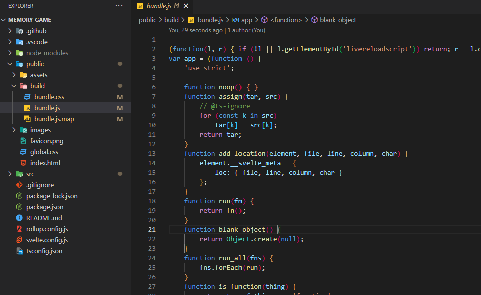
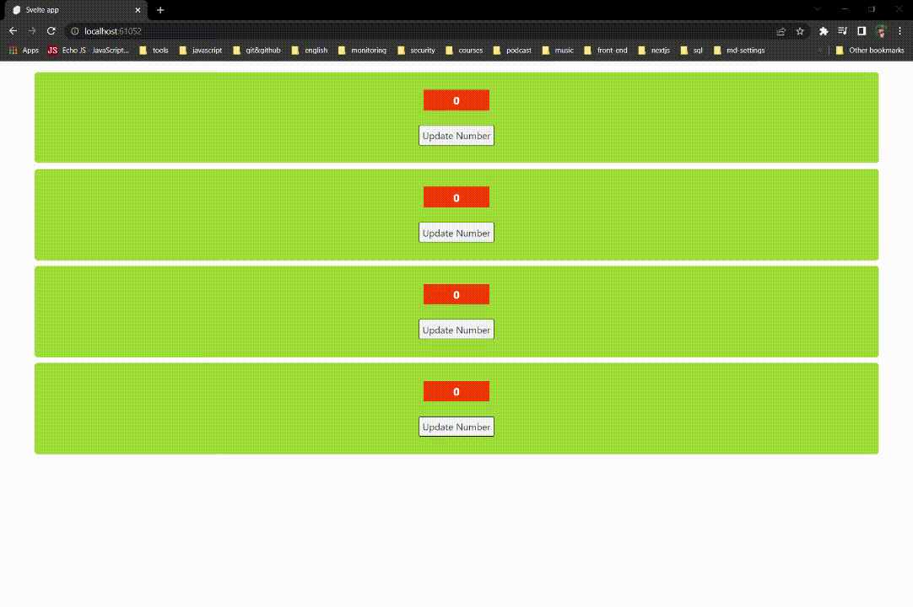
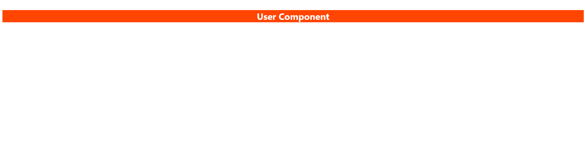
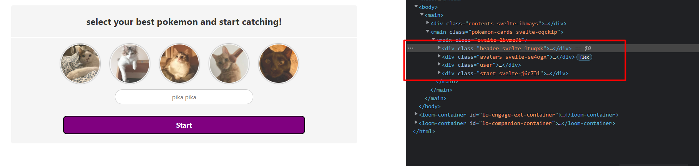
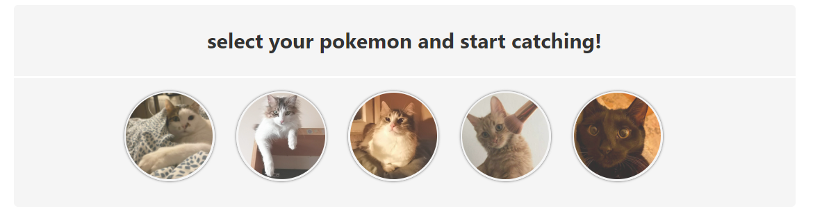

<span id="selam-sana"></span>

## Selamlaaaaar 👋

Herşeyden önce umuyorum ki bu basit döküman Svelte yolculuğunda rehber
olabilir. Son zamanlarda Svelte ile uygulama geliştirmeye başladım. Svelte'in
yapısına daha çok hakim olabilmek ve öğrendiklerimi paylaşabilmek için bu
dökümanı oluşturdum. Döküman içerisinde adım adım _Game_ bağlantısında
görebileğin oyunu nasıl geliştirdiğimi anlattım, ilgi duyuyorsan aynı
adımları takip ederek benzer bir uygulama oluşturabilir, veya küçük bir kaynak
modelinde kullanabilirsin. Svelte içeriği iyi ayrıntılanmış dökümantasyonlara
([docs](https://svelte.dev/docs "Svelte Documentation"),
[examples](https://svelte.dev/examples/hello-world "Svelte Examples")) sahip,
dökümantasyonları inceledikten sonra uygulamayı takip etmen daha faydalı
olabilir.

<p align="center">
  
</p>

İçeriğin detaylarını sol tarafta yer alan haritalandırma ile takip
edebilirsin. İlk bölümlerde Svelte'i nasıl kullanabileceğine dair
bilgilendirmeler yer alıyor. Bu kısımlara hakimsen, atlayarak Start Game
bölümünden devam edebilirsin.

<span id="proje-hakkinda"></span>

## 🪁 Oyun hakkında

Projemizde bir hafıza oyunu geliştireceğiz. Kullanıcıların seviyelerine göre
arayüz üzerinde kartlar bulunacak. Kartlara click eventi gerçekleştiğinde
kartlar açılacak, kullanıcılar açılan kartları eşleştirmeye çalışacaklar.
Eşleşen kartlar açık bir şekilde arayüz üzerinde dururken başarılı eşleşme
sonucunda kullanıcıya puan kazandıracak, başarısız her eşleşmede kartlar
bulundukları yerde yeniden kapatılacaklar. Bütün kartlar eşleştiklerinde, bir
sonraki seviyede yer alan kartlar arayüze kapalı olarak yeniden gelecektir.

<p align="center">
  
</p>

Oyun başlangıcında kullanıcıdan bir kullanıcı adı girmesi, avatar listesinde
yer alan görsellerden birini seçmesi beklenecektir (Avatarlar ne kadar evcil
gözükseler de, güç içlerinde gizli 🐱‍👤). Bu seçilen değerler oyunun arayüzünde
kartların yer aldığı bölümün altında _score & level_ değerleri ile
birlikte gösterilecektir. Kullanıcı adı ve seçilen avatar stabil değerler olarak
tutulurken, _score & level_ değerleri dinamik olarak kullanıcı davranışına göre
güncellenecektir.

<span id="svelte-nedir"></span>

## 🪁 Svelte nedir?

Svelte günümüz modern library ve framework habitatının komplex yapılarını
azaltarak daha basit şekilde yüksek verimliliğe sahip uygulamalar
geliştirilmesini sağlamayı amaçlayan bir derleyicidir. Modern framework/library
ile birlikte geride bıraktığımız her süreçte farklı ihtiyaçlar için yeni bir
öğrenme süreci ortaya çıktı. Öğrenme döngüsünün sürekli olarak geliştiricilerin
karşısına çıkması bir süre sonrasında illallah dedirtmeye başladığı gayet
aşikar. Svelte alışık olduğumuz _html & css & js_ kod yapılarına benzer bir
sözdizimine sahip olması, props ve state/stores güncellemeleri için 40 takla
atılmasına gerek kalınmaması gibi özellikleri ile bu döngünün dışına çıkmayı
başarabilmiş.. ve umuyorum ki bu şekilde sadeliğini korumaya devam edebilir.

[Stack Overflow Developer Survey 2021](https://insights.stackoverflow.com/survey/2021#section-most-loved-dreaded-and-wanted-web-frameworks "Stack Overflow Developer Survey 2021") anketinde geliştiriciler tarafından %71.47 oranıyla en çok sevilen
web framework Svelte olarak seçildi.

## 🪁 Basit ifadeler

Bazı bölümlerde aynı kelimeleri tekrar etmemek için, bazı kısayol ifadeleri
kullandım(tamamen salladım). Sayısı çok fazla değil, sorun yaşamayacağını
düşünüyorum.

- `_Playground_`
  - Playground.svelte Component
- `+ User.svelte`
  - _User.svelte_ dosyası oluşturuldu.
- `Avatar/`
  - _Avatar_ klasörü oluşturuldu.
- `+ User.svelte + Header.svelte + Avatars.svelte`
  - _User.svelte, Header.svelte, Avatars.svelte_ dosyaları oluşturuldu.
- `+ User > Avatar.svelte`
  - _User_ klasörü içerisinde _Avatar.svelte_ dosyası oluşturuldu.
- `+ public > assets > images > pasa.jpg, sabuha.jpg`
  - _public > assets > images_ klasörü içerisinde _pasa.jpg_, _sabuha.jpg_
    dosyaları oluşturuldu.

<span id="svelte-projesi-olusturma"></span>

## 🪁 Svelte projesi oluşturma

Npx ile yeni bir proje oluşturma:

```js
npx degit sveltejs/template remember-em-all
```

Svelte Typescript notasyonunu desteklemektedir. Typescript üzerinde
yapabileceğiniz bütün işlemleri Svelte projende kullanabilirsin.

```js
cd remember-em-all
node scripts/setupTypeScript.js
```

Gerekli olan bağımlılıkları projemize ekleyerek ayağa kaldırabiliriz.

```js
npm install
npm run dev
```

Bu komutlar sonrasında konsol üzerinde projenin hangi port üzerinde çalıştığını
görebilirsin. Windows işletim sistemlerinde varsayılan 8080 portu işaretli
iken, bu port üzerinde çalışan proje bulunuyorsa veya farklı işletim sistemi
kullanıyorsan port adresi değişkenlik gösterebilir.

<p align="center">
  
</p>

<span id="svelte-nasil-calisir"></span>

## 🪁 Svelte nasıl çalışır?

Svelte bileşenleri _.svelte_ uzantılı dosyalar ile oluşturulur. HTML'de benzer
olarak _script, style, html_ kod yapılarını oluşturabilirdiğiniz üç farklı bölüm
bulunuyor.

Uygulama oluşturduğumuzda bu bileşenler derlenerek, pure Javascript
kodlarına dönüştürülür. Svelte derleme işlemini runtime üzerinde
gerçekleştiriyor. Bu derleme işlemiyle birlikte Virtual DOM bağımlılığını
ortadan kalkıyor.

<p align="center">
  
</p>

<span id="bagimliliklar"></span>

## 🪁 Proje bağımlılıkları

- #### Typescript
  Typescript, Javascript kodunuzu daha verimli kılmanızı ve kod kaynaklı
  hataların önüne geçilmesini sağlayan bir Javascript uzantısıdır. Projenizde
  yer alan _.svelte_ uzantılı dosyalarda kullanabileceğiniz gibi, _.ts_
  dosyalarını da destekler.
- #### Rollup
  Svelte kurulumunuzla birlikte root folder üzerinde rollup.config.js dosyası
  oluşturulacaktır. Rollup Javascript uygulamalar için kullanılan bir modül
  paketleyicidir, uygulamamızda yer alan kodları tarayıcının anlayabileceği
  şekilde ayrıştırır.

<span id="svelte-projesini-inceleme"></span>

## 🪁 Svelte yapısını inceleme

Varsayılan _src/App.svelte_ dosyasını kontrol ettiğimizde daha önce
değindiğimiz gibi _Javascript_ kodları için _script_, _html_ kodları için _main_
ve stillendirme için _style_ tagları bulunuyor.

🎈 _script_ etiketinde _lang_ özelliği Typescript bağımlılığını eklediğimiz
için _ts_ değerinde bulunmaktadır. Typescript kullanmak istediğin _svelte_
dosyalarında _lang_ özelliğine _ts_ değerini vermen yeterli olacaktır.

🎈 _main_ etiketinde _html_ kodlarını tanımlayabileceğin gibi, bu etiketin
dışında da dilediğin gibi _html_ kodlarını tanımlayabilirsin. Svelte
tanımladığın kodları _html_ kodu olarak derlemesine rağmen, proje yapısının
daha okunabilir olabilmesi için kapsayıcı bir etiketin altında toplanması daha
iyi olabilir.

🎈 _style_ etiketi altında tanımladığın stil özelliklerinden, aynı dosyada
bulunan _html_ alanında seçiciler etkilenir. Global seçicileri
tanımlayabilir veya global olarak tanımlamak istediğin seçicileri
`public/global.css` dosyasında düzenleyebilirsin.

🎈 Proje içerisinde compile edilen bütün yapılar `/public/build/bundle.js`
dosyasında yer almaktadir. _index.html_ dosyası buradaki yapıyı referans alarak
Svelte projesini kullanıcı karşısına getirmektedir.

## 🪁 Biraz pratik

Birkaç örnek yaparak Svelte'i anlamaya, yorumlamaya çalışalım. Kod örnekleri
oyun üzerinde sıkça kullanacağımız yapılar için bir temel oluşturacak.

_App.svelte_ dosyasında _name_ isminde bir değişken tanımlanmış. Typescript
notasyonu baz alındığı için değer tipi olarak _string_ verilmiş. Bu notasyon ile
anlatım biraz daha uzun olabileceği için kullanmamayı tercih edicem. Github
üzerinde bulunan kodlar ile, burada birlikte oluşturacaklarımız farklılık
gösterebilir.. panik yok, Typescript'e [hakim olabileceğine](https://youtube.com/shorts/oyIO1_8uNPc "senin kocaman kalbin <33")
eminim.

### 🎈 Variable erişimi

Script üzerinde tanımlanan değerleri html içerisinde çağırabilmek için
&lcub; &rcub; kullanılmalıdır. Bu template ile değer tipi farketmeksizin
değişkenleri çağırarak işlemler gerçekleştirilebilir.

_app.svelte_

<div class="code-wrapper" style="padding:0 10px; margin: 0 30px; border: 2px dashed #ff3e00; background: #fff;">
<pre style="border: none;" class="prettyprint lang-js">
{`\<script>
  const user = "sabuha";
</script>`}
</pre>
<pre style="border: none;" 
  class="prettyprint lang-html">{`\<span>{user} seni izliyor!</span>
`}</pre>
<pre style="border: none;" class="prettyprint lang-css">{`\<style>
  h1 {
    color: rebeccapurple;
  }
</style>`}</pre>
</div>

Bu tanımlama ile birlikte _user_ değerine tanımlanan her değeri dinamik olarak
_html_ içerisinde çağırabilirsin. biraz daha biraz daha karıştıralım..
_user_ tanımlaması _sabuha_ değerine eşit olduğu durumlarda 'seni izliyor!'
yerine 'bir kedi gördüm sanki!' değerini ekrana getirelim.

_app.svelte_

<div class="code-wrapper" style="padding:0 10px; margin: 0 30px; 
  border: 2px dashed #ff3e00; background: #fff;">
<pre style="border: none;" class="prettyprint lang-js">
{`\<script>
  const user = "sabuha";
</script>`}
</pre>
<pre style="border: none;" 
  class="prettyprint lang-html">{`\<span>{user === "sabuha" ? "bir kedi gördüm sanki!" : "seni izliyor!"}</span>
`}</pre>
<pre style="border: none;" class="prettyprint lang-css">{`\<style></style>`}</pre>
</div>

_html_ içerisinde kullandığımız &lcub; &rcub; tagları arasında condition
yapıları gibi döngü, fonksiyon çağırma işlemleri gerçekleştirebilirsin. Bu
yapılara sahip birçok işlemi birlikte gerçekleştireceğiz.

### 🎈 Reaktif değişkenler

Değişkenlik gösterebilecek dinamik verilerin güncellendiğinde, DOM üzerinde
yer alan referansı benzer olarak güncellenir.

_app.svelte_

<div class="code-wrapper" style="padding:0 10px; margin: 0 30px; 
border: 2px dashed #ff3e00; background: white;">
<pre style="border: none;" class="prettyprint lang-js">
{`\<script>
  let number = 0;
  
  const randomNumber = () => {
    number = Math.round(Math.random() \* 15);
  };
</script>`}

</pre>
<pre style="border: none;" 
  class="prettyprint lang-html">{`\
<main>
  <h3>{number}</h3>
  <button on:click={randomNumber}>Update Number</button>
</main>
`}</pre>
<pre style="border: none;" class="prettyprint lang-css">{`\<style>
  main {
    border-radius: 5px;
    background-color: yellowgreen;
    padding: 5px;
    margin: 10px 50px;
  }
  
  h3 {
    background-color: orangered;
    width: 100px;
    color: white;
  }
  
  button {
    border: 1px solid black;
    cursor: pointer;
  }
  
  h3,button {
    display: block;
    text-align: center;
    margin: 25px auto;
    padding: 5px;
  }
</style>`}</pre>
</div>

Tanımladığımız _numb_ değeri her güncellendiğinde, DOM üzerinde bu değer
yeniden ve sıkılmadan güncellenmeye devam edecektir.

<p align="center">
  
</p>

### 🎈 Component kullanımı

Uygulamalarımızda yer alan bileşenleri parçalayarak istediğimiz gibi bir bütün
haline getirebilmek üzerinde çalışırken kolaylık sağlar, tekrar eden bileşen
parçalarında yeniden çağırabilmek daha az efor sarfettirir.

<p align="center">

</p>

Bir önceki örnekte yaptığımız random sayı üreten basit yapıyı bir component
haline getirelim.

`components/Content/` dizininde `RandomNumber.svelte` dosyasını oluşturalım.
Bu yeni componentimizi `App.svelte` dosyasında kullanalım.

_Components > Content > RandomNumber.svelte_

<div class="code-wrapper" style="padding:0 10px; margin: 0 30px; 
border: 2px dashed #ff3e00; background: white;">
<pre style="border: none;" class="prettyprint lang-js">
{`\<script>
  let number = 0;
  
  const randomNumber = () => {
    number = Math.round(Math.random() \* 15);
  };
</script>`}

</pre>
<pre style="border: none;" 
  class="prettyprint lang-html">{`\
<div class="random-number-capsule">
  <h3>{number}</h3>
  <button on:click={randomNumber}>Update Number</button>
</div>
`}</pre>
<pre style="border: none;" class="prettyprint lang-css">{`\<style>
  .random-number-capsule {
    border-radius: 5px;
    background-color: yellowgreen;
    padding: 5px;
    margin: 10px 50px;
  }
  
  h3 {
    background-color: orangered;
    width: 100px;
    color: white;
  } 
  
  button {
    border: 1px solid black;
    cursor: pointer;
  } 
  
  h3,
  button {
    display: block;
    text-align: center;
    margin: 25px auto;
    padding: 5px;
  }
</style>`}</pre>
</div>

`RandomNumber` componentini istediğimiz gibi çağırarak kullanmaya
başlayabiliriz.

_App.svelte_

<div class="code-wrapper" style="padding:0 10px; margin: 0 30px; 
border: 2px dashed #ff3e00; background: white;">
<pre style="border: none;" class="prettyprint lang-js">
{`\<script>
  \import RandomNumber from "./components/Content/RandomNumber/RandomNumber.svelte";  
</script>`}

</pre>
<pre style="border: none;" 
  class="prettyprint lang-html">{`\
<main>
  <RandomNumber />
  <RandomNumber />
  <RandomNumber />
  <RandomNumber />
</main>
`}</pre>
<pre style="border: none;" class="prettyprint lang-css">{`\<style>
</style>`}</pre>
</div>

<p align="center">

</p>

### 🎈 Componentler Arası İletişim

<p align="center">

</p>

Küçük yapılı projelerden, komplex yapılılara kadar birçok component üzerinden
alıp farklı bir yerde kullanma, güncelleme gibi ihtiyaçlarımız olacak.
Kullanılan framework, library veya compiler'in bu ihtiyacınıza esnek çözümler
sağlayabilmesi gerekiyor. Svelte bu ihtiyaçlarınız için birden fazla ve basit
yapılara sahip çözümler barındırıyor.

#### 🎈🎈 Props

Props kullanarak dataları bir component üzerinden farklı componentlere
aktarabilirsiniz. Componentler arası bu ilişki parent-child ile ifade edilir.
Parent üzerinden child componentlere veri aktarabiliyorken, aynı zamanda child
component üzerinden parent componente veri iletebilirsiniz.

#### 🎈🎈 Slots

Parent-child ilişkisinde olduğu gibi verilerin alt componente
aktarılmasında kullanabilirsin. Bir template dahilinde (html içeririkleri gibi)
verilerin aktarılmasına izin verir.

#### 🎈🎈 Context

Bir veriyi iletmeniz gereken component sayısı arttıkça, yapısını kurgulamak ve
takibini sağlamak zor ve bir yerden sonra da oldukça sıkıcı bir duruma
dönüşebilir. Context ile dataların parent üzerinden child componentler
üzerinde erişilmesini sağlar.

#### 🎈🎈 Module Context

Component üzerinde kullandığınız veri farklı bir Component'da yer alıyorsa ve
çalışmaları birbirlerine bağımlı olduğu senaryolarda Module Context Componentlar
arasında bu senaryonun uygulanmasını sağlıyor. Verileri birden çok component ile
paylaşılmasını olanak tanır.

#### 🎈🎈 Store

Veri taşımacılık ltd. şti.'nin joker kartı.. Verilerinizi her yerde
güncellenmesini, çağırılmasını sağlar. Kullanımı için bir hiyerarşi içerisinde
olmasına gereksinimi bulunmuyor.

## 🎈 Svelte lifecycle

## 🪁 Start Game

Svelte'i biraz daha yakından tanıyoruz, birlikte uygulamamızı oluşturabilmek
için yeteri kadar bilgi sahibi olduk. Kullanıcının arayüz olarak görebileceği
iki Component bulunuyor. Kullanıcı adı ve avatar seçtiği User Component, bu
seçimler sonrasında erişilen Playground Component. User Componenti ile oyunumuzu
oluşturmaya başlayalım. [Yeni bir proje oluşturabilir](#svelte-projesi-olusturma "Yeni bir Svelte Projesi oluştur")
veya pratik yapabilmek için şuana kadarki kodları kaldırabilirsin.
_src > components > User_ ve _src > components > Playground_ klasörlerini
oluşturalım.

<p align="center">

</p>

### 🎈 User Component

_User_ klasörü altında Kullanıcıdan alacağımız her değer için _Avatar_ ve
_Name_ klasörlerini oluşturalım. Root klasörde _User_ Component altında
tanımlanan bütün yapıların yer alacağı bir kapsayıcı dahil edeceğiz.
_UserGround.svelte_ isminde bir dosya oluşturuyorum, parçaladığımız bütün
componentler burada yer alacak.

_Playground_ klasörü içerisinde buna benzer bir yapıyı oluşturarak, oyun
içerisindeki bütün componentleri aynı dosya üzerinde çağıracağız.
_Playground_ altında _Wrapper > Playground.svelte_ dizin ve dosyasını
oluşturalım.

User Componenti üzerinde çalışırken, yapacağımız değişiklikleri inceleyebilmek
için User Component'ini _Playground > Wrapper > Playground.svelte_ dosyasında
çağıralım.

_User > UserGround.svelte_

<div class="code-wrapper" style="padding:0 10px; margin: 0 30px; 
border: 2px dashed #ff3e00; background: white;">
<pre style="border: none;" class="prettyprint lang-js">
{`\<script>
  const componentDetail = "User";
</script>`}

</pre>
<pre style="border: none;" 
  class="prettyprint lang-html">{`\
<main>
  <h2>{componentDetail} Component</h2>
</main>
`}</pre>
<pre style="border: none;" class="prettyprint lang-css">{`\<style>
  h2 {
    color: white;
    background-color: orangered;
    text-align: center;
  }
</style>`}</pre>
</div>

_Playground > Wrapper > Playground.svelte_

<div class="code-wrapper" style="padding:0 10px; margin: 0 30px; 
border: 2px dashed #ff3e00; background: white;">
<pre style="border: none;" class="prettyprint lang-js">
{`\<script>
  \import Userground from "../../User/Userground.svelte";
</script>`}

</pre>
<pre style="border: none;" 
  class="prettyprint lang-html">{`\
<main>
   <UserGround />
</main>
`}</pre>
<pre style="border: none;" class="prettyprint lang-css">{`\<style>
  h2 {
    color: white;
    background-color: orangered;
    text-align: center;
  }
</style>`}</pre>
</div>

_User Component_ çağırdıktan sonra üzerinde geliştirme yapmaya başlayalım.

<p align="center">

</p>

Component üzerinde 4 farklı bölüm yer alıyor.

- Kullanıcıyı bilgilendiren bir header yazısı
- Kullanıcının görseller üzerinden avatar seçimi yapabildiği bir bölüm
- Kullanıcı adının girilebilmesi için alan
- Ve bütün bunlar tamamlandığında oyuna start veren bir button elementi
  bulunuyor.

<p align="center"> 
  
</p>

### 🎈 Header Component

Root folder üzerinde _Header.svelte_ isminde bir Component oluşturuyorum.
Önceki örneklerde gerçekleştirdiğimiz gibi, _Header.svelte_ Componentini
_Userground.svelte_ componenti üzerinde çağıralım. Oluşturduğumuz
_Header.svelte_ componentinin basit bir görevi bulunuyor, statik bir metin
barındırıyor.

_User > Header.svelte_

<div class="code-wrapper" style="padding:0 10px; margin: 0 30px; 
border: 2px dashed #ff3e00; background: white;">
<pre style="border: none;" class="prettyprint lang-js">
{`\<script></script>`}

</pre>
<pre style="border: none;" 
  class="prettyprint lang-html">{`\
<div class="header">
  <h2>select your best pokemon and start catching!</h2>
</div>
`}</pre>
<pre style="border: none;" class="prettyprint lang-css">{`\<style>
  .header {
    padding: 5px 0;
    margin-bottom: 15px;
    border-bottom: 3px solid white;
  }
</style>`}</pre>
</div>

_User > UserGround.svelte_

<div class="code-wrapper" style="padding:0 10px; margin: 0 30px; 
border: 2px dashed #ff3e00; background: white;">
<pre style="border: none;" class="prettyprint lang-js">
{`\<script>
  \import Header from "./Header.svelte";
</script>`}

</pre>
<pre style="border: none;" 
  class="prettyprint lang-html">{`\
<main>
  <Header />
</main>
`}</pre>
<pre style="border: none;" class="prettyprint lang-css">{`\<style>
  main {
    background-color: #f5f5f5;
    border-radius: 5px;
    padding-bottom: 15px;
  }
</style>`}</pre>
</div>

<p align="center">
  
</p>

Süper iğrenç gözüküyor, öyle değil mi? İyi ki CSS var..

_Playground > Wrapper > Playground.svelte_

<div class="code-wrapper" style="padding:0 10px; margin: 0 30px; 
border: 2px dashed #ff3e00; background: white;">
<pre style="border: none;" class="prettyprint lang-js">
{`\<script>
  \import Userground from "../../User/Userground.svelte";
</script>`}

</pre>
<pre style="border: none;" 
  class="prettyprint lang-html">{`\
<main class="playground">
   <Userground />
</main>
`}</pre>
<pre style="border: none;" class="prettyprint lang-css">{`\<style>
  .playground {
    width: 900px;
    margin: 0 auto;
    text-align: center;
  }
</style>`}</pre>
</div>

Ehh... şimdi biraz daha az kötü gözüktüğü söylenebilir💩💩💩

### 🎈 Avatar Component

Bu Component içerisinde birden fazla bileşene ihtiyaç duyduğu için, bir klasör
oluşturarak bütün gereksinim duyduğu yapıları klasör içerisinde tanımlayalım.

- `Avatar/`
- `+ User > Avatar > Avatars.svelte, ImageAvatar.svelte`
- `+ public > assets > images > pasa.jpg, sabuha.jpg, mohito.jpg, limon.jpg, susi.jpg`
- [images](https://github.com/kahilkubilay/remember-em-all/tree/master/public/images "Images link")

_Avatars.svelte_ _Userground.svelte_ içerisinde çağıralım. _Avatars.svelte_,
_ImageAvatar.svelte_ bir kapsayıcı görevi görecek. Bununla birlikte
_ImageAvatar.svelte_ componentine data gönderecek.

_User > Avatar > Avatars.svelte_

<div class="code-wrapper" style="padding:0 10px; margin: 0 30px; 
border: 2px dashed #ff3e00; background: white;">
<pre style="border: none;" class="prettyprint lang-js">
{`\<script>
  // avatar list
  let sabuha = "/asset/images/sabuha.jpg";
  let pasa = "/asset/images/pasa.jpg";
</script>`}
</pre>
<pre style="border: none;" 
  class="prettyprint lang-html">{`\
<div class="avatars">
  
  
</div>
`}</pre>
<pre style="border: none;" class="prettyprint lang-css">{`\<style>
 img {
    width: 100px;
  }
</style>`}</pre>
</div>

_Avatars_, _Userground_ üzerinde çağırdığımda karşıma bu iki güzellik gelecek.

<p align="center"> 
  
</p>

_Avatars_ biraz daha işlevli bir yapıya büründürelim.

_User > Avatar > Avatars.svelte_

<div class="code-wrapper" style="padding:0 10px; margin: 0 30px; 
border: 2px dashed #ff3e00; background: white;">
<pre style="border: none;" class="prettyprint lang-js">
{`\<script>
  \import ImageAvatar from "./ImageAvatar.svelte";

// avatar list
let sabuha = "/asset/images/sabuha.jpg";
let mohito = "/asset/images/mohito.jpg";
let pasa = "/asset/images/pasa.jpg";
let susi = "/asset/images/susi.jpg";
let limon = "/asset/images/limon.jpg";

const avatars = [pasa, mohito, sabuha, limon, susi];
</script>`}

</pre>
<pre style="border: none;" 
  class="prettyprint lang-html">{`\
<div class="avatars">
 { #each avatars as avatar}
    <ImageAvatar {avatar} />
{ /each}

</div>
`}</pre>
<pre style="border: none;" class="prettyprint lang-css">{`\<style>
 .avatars {
    display: flex;
    justify-content: center;
  }
</style>`}</pre>
</div>

Oluşturduğumuz `avatars` dizisine ait her elemana _html_ üzerinde #each
döngüsünde erişiyoruz. Erişilen her elemanının bilgisini _ImageAvatar_
componentine aktarıyoruz. Componente aktarılan bu değerlerle birlikte,
dizi içerisinde bulunan her elamanın görüntüsünü elde edeceğiz.

_User > Avatar > ImageAvatar.svelte_

<div class="code-wrapper" style="padding:0 10px; margin: 0 30px; 
border: 2px dashed #ff3e00; background: white;">
<pre style="border: none;" class="prettyprint lang-js">
{`\<script>
  \export let avatar;
</script>`}
</pre>
<pre style="border: none;" 
  class="prettyprint lang-html">{`\

`}</pre>
<pre style="border: none;" class="prettyprint lang-css">{`\<style>
  .avatar {
    width: 100px;
    border-radius: 100px;
    justify-content: space-around;
    margin: 0 25px 15px 0;
    border: 2px solid #fff;
    box-shadow: 0px 0px 3px black;
    border: 2px solid whitesmoke;
  }
  
  .avatar:hover {
    opacity: 1;
    cursor: pointer;
  }
  
  .unpicked {
    opacity: 0.8;
  }
  
  .picked {
    opacity: 1;
  }
</style>`}</pre>
</div>

Daha güzel bir görüntüyü hak ettik. Avatarlar üzerinde CSS ile biraz
düzenlemeler yapmamız gerekti.

<p align="center"> 
  
</p>

### 🎈 Name Component

Pokemon eğitmenimizin bir isim girebilmesi için gerekli olan componenti
oluşturalım.

`+ /User/Avatar/Name`

`+ /User/Avatar/Name/UserName.svelte`

_User > Avatar > Name > UserName.svelte_

<div class="code-wrapper" style="padding:0 10px; margin: 0 30px; 
border: 2px dashed #ff3e00; background: white;">
<pre style="border: none;" class="prettyprint lang-js">
{`\<script></script>`}
</pre>
<pre style="border: none;" 
  class="prettyprint lang-html">{`\
<div class="user">
  <input type="text" class="name" name="name" placeholder="pika pika" />
</div>
`}</pre>
<pre style="border: none;" class="prettyprint lang-css">{`\<style>
   .name {
    width: 40%;
    border-radius: 20px;
    text-align: center;
    margin-bottom: 30px;
    padding: 8px 0;
  }
</style>`}</pre>
</div>

Diğer componentlerde yaptığımız gibi, _UserName_ componentinin _Userground_
componentinde kullanalım.

Geriye son bir componentimiz kaldı. "Start" yazısına sahip bir buton
componentini oluşturarak, _User_ klasöründe _Start.svelte_ ismiyle kaydedererek
_UserGround_ componentinde çağıralım.

Ta daaaa... Şuana kadar yaptığımız componentler dinamik işlemler
gerçekleştirmedi. Arayüzü oluşturmak için yeteri kadar malzememiz ortaya çıktı,
ve bunları istediğin gibi stillendirebilirsin. Bundan sonraki aşamalarda bu
componentlara dinamik özellikler kazandıracağız.

<p align="center"> 
  
</p>

## 🪁 Oyun Gereksinimleri

<span id="component-ve-dizin-yapisi"></span>

<span id="github-page-ile-deploy"></span>

## GitHub Pages ile Deploy

## Kaynak

- Svelte nedir?

- https://svelte.dev/blog/svelte-3-rethinking-reactivity

- Svelte Documentation:

- https://svelte.dev/examples/hello-world
- https://svelte.dev/tutorial/basics
- https://svelte.dev/docs
- https://svelte.dev/blog
- https://svelte.dev/blog/svelte-3-rethinking-reactivity

* Svelte Projesi Oluşturma

- https://developer.mozilla.org/en-US/docs/Learn/Tools_and_testing/Client-side_JavaScript_frameworks/Svelte_TypeScript

- Bağımlılıklar
- https://typeofnan.dev/how-to-set-up-a-svelte-app-with-rollup/

* Deploy:

- https://developer.mozilla.org/en-US/docs/Learn/Tools_and_testing/Client-side_JavaScript_frameworks/Svelte_deployment_next

* md files importing

- https://stackoverflow.com/questions/56678488/how-to-import-a-markdown-file-in-a-typescript-react-native-project

* Component Communications

- https://betterprogramming.pub/6-ways-to-do-component-communications-in-svelte-b3f2a483913c
- https://livebook.manning.com/book/svelte-and-sapper-in-action/chapter-5/v-3/

```

```

:check en file:
